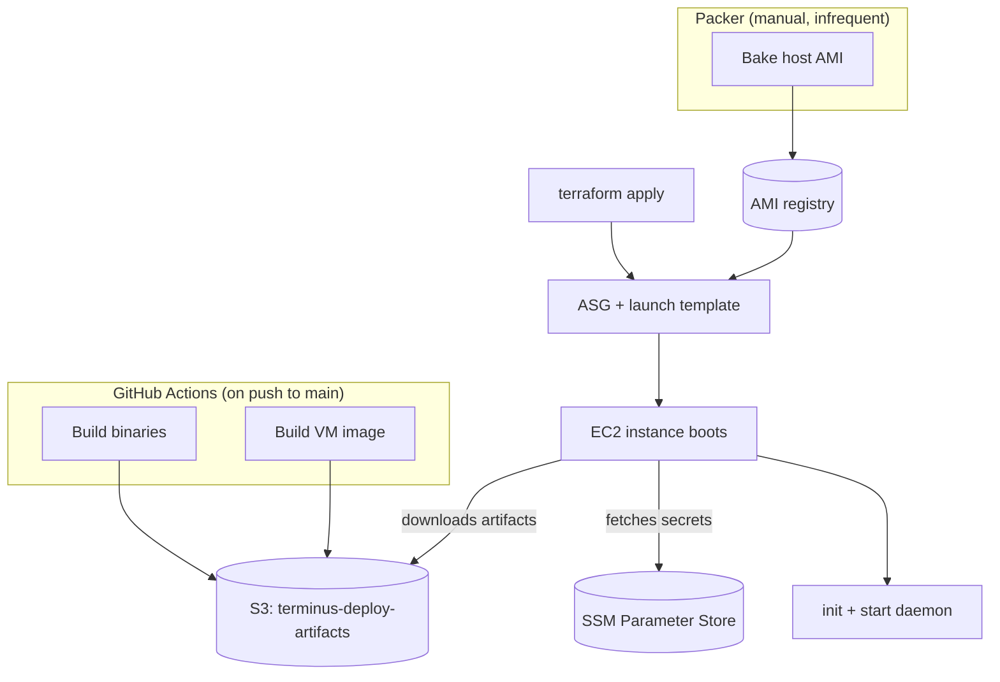

# Stockyard Deploy Pipeline — Design Spec

## Goal

Add Terraform, GitHub Actions CI, and Packer to the stockyard repo so it
deploys onto the Terminus shared infrastructure. Replace the current pattern
(SSH in, build from source on the host) with: CI builds artifacts → S3 →
`terraform apply` → instance boots and downloads artifacts.

## Architecture



Terraform reads shared infra outputs (VPC, subnets, artifact bucket) from the
terminus repo via `terraform_remote_state`.

## Repo Structure (new files)

```
stockyard/
  .github/
    workflows/
      build.yml               # CI: build + upload to S3
  terraform/
    backend.tf                # S3 backend, terminus remote state
    main.tf                   # machine-service module instantiation
    variables.tf              # instance_type, ami_id, stockyard_version, secrets
    outputs.tf                # ASG name, SG ID
    user-data.sh.tftpl        # Thin boot script (6 steps)
  packer/
    stockyard-host.pkr.hcl   # Host AMI build
  .gitignore                  # Add *.tfvars, .terraform/ patterns to existing
```

Existing code (`cmd/`, `pkg/`, `vm-image/`, `Makefile`) is unchanged. CI calls
the same `make` targets a human would.

## GitHub Actions CI

### Workflow: build.yml

**Trigger:** push to `main`

**Auth:** OIDC with an IAM role (same pattern as sen-deploy). Role needs:
- `s3:PutObject` on `terminus-deploy-artifacts/stockyard/*`
- `s3:GetObject` on `terminus-deploy-artifacts/stockyard/*` (for kernel cache)

**Steps:**

1. Checkout
2. Set up Go
3. Build binaries: `make build`
4. Build `stockyard-shell`: `make build-shell`
5. Kernel decision:
   - Check if `vm-image/kernel.config` changed in this push
   - If unchanged: download last `vmlinux.bin` from S3 cache
     (`s3://terminus-deploy-artifacts/stockyard/kernel/vmlinux.bin`)
   - If changed: build full VM image including kernel, upload new kernel to
     cache location
6. Build VM rootfs: `make -C vm-image rootfs`
   - If kernel was cached, inject the cached `vmlinux.bin` into the output
     directory before running the rootfs build so it skips the kernel compile
7. Upload artifacts to S3:
   ```
   s3://terminus-deploy-artifacts/stockyard/{git-sha}/
     stockyardd
     stockyard
     rootfs.ext4
     vmlinux.bin
   ```
8. Update latest pointer:
   ```
   s3://terminus-deploy-artifacts/stockyard/latest  →  {git-sha}
   ```

**Not triggered:** `terraform apply` or any deploy action. CI builds, humans
deploy.

### Kernel caching detail

The kernel build (compile Linux from source) takes 10-20 minutes. The kernel
config changes rarely. CI caches the built kernel at a well-known S3 path and
only rebuilds when `vm-image/kernel.config` changes. This turns most CI runs
from ~20 minutes to ~3 minutes.

The cache path is separate from versioned releases:
```
s3://terminus-deploy-artifacts/stockyard/kernel/vmlinux.bin   # cache
s3://terminus-deploy-artifacts/stockyard/{sha}/vmlinux.bin    # release
```

## Terraform

### State

```
s3://terminus-terraform-state/services/stockyard/terraform.tfstate
```

DynamoDB lock table: `terminus-terraform-locks` (shared with terminus infra).

### Remote state

Reads terminus infra outputs:
```hcl
data "terraform_remote_state" "infra" {
  backend = "s3"
  config = {
    bucket = "terminus-terraform-state"
    key    = "infra/terraform.tfstate"
    region = "us-west-1"
  }
}
```

### Module usage

Instantiates `machine-service` from terminus:
```hcl
module "stockyard" {
  source = "git::ssh://git@github.com/prime-radiant-inc/terminus.git//terraform/modules/machine-service?ref=main"

  name          = "stockyard"
  instance_type = var.instance_type
  ami_id        = var.ami_id
  vpc_id        = local.infra.vpc_id
  subnet_ids    = local.infra.public_subnet_ids

  desired_capacity = var.instance_on ? 1 : 0
  max_instances    = 1
  use_spot         = true
  root_volume_size = 100

  cpu_options = { nested_virtualization = "enabled" }

  ssm_parameters = {
    TAILSCALE_AUTH_KEY = var.tailscale_auth_key
    ANTHROPIC_API_KEY  = var.anthropic_api_key
    GITHUB_TOKEN       = var.github_token
  }

  iam_policy_statements = [{
    Effect   = "Allow"
    Action   = ["s3:GetObject"]
    Resource = ["arn:aws:s3:::${local.infra.artifacts_bucket}/stockyard/*"]
  }]

  user_data = templatefile("${path.module}/user-data.sh.tftpl", {
    region            = local.infra.region
    artifacts_bucket  = local.infra.artifacts_bucket
    stockyard_version = var.stockyard_version
  })
}
```

### Variables

```hcl
instance_type       # default "c8i.xlarge"
ami_id              # explicit AMI ID from Packer build
instance_on         # bool, default true (set false to turn off)
stockyard_version   # default "latest", or a git SHA
tailscale_auth_key  # sensitive, via .tfvars
anthropic_api_key   # sensitive, via .tfvars
github_token        # sensitive, via .tfvars
```

### Secrets flow

1. Developer puts secrets in `terraform/secrets.tfvars` (gitignored)
2. Terraform writes them to SSM as `SecureString` under `/stockyard/`
3. Instance reads from SSM at boot via `aws ssm get-parameter`
4. To rotate: update `.tfvars`, `terraform apply`

### User-data (thin)

Six steps, all runtime-dependent:
1. Tailscale up (needs auth key from SSM)
2. Download release artifacts from S3 (binaries + VM image)
3. Create ZFS pool (depends on instance storage)
4. Configure networking (bridge + NAT for Firecracker VMs)
5. Initialize stockyard (config + secrets from SSM)
6. Start daemon

Everything else (Firecracker, ZFS tools, Tailscale binary, AWS CLI, systemd
units) is pre-baked in the AMI.

## Packer

### Location

`stockyard/packer/stockyard-host.pkr.hcl`

### Run manually

```bash
cd packer
packer init .
packer build .
```

Produces a named AMI. Copy the AMI ID into
`terraform/variables.tf` (or pass via `-var ami_id=ami-xxx`).

### What it bakes

- Firecracker + jailer (pinned version)
- `zfsutils-linux`
- Tailscale
- AWS CLI v2
- KVM module setup
- systemd unit for `stockyardd`
- Directory structure (`/var/lib/stockyard`, `/etc/stockyard`, `/var/log/stockyard`)

### What it does NOT bake

- Stockyard binaries (downloaded from S3 at boot)
- VM rootfs + kernel (downloaded from S3 at boot)
- Secrets (fetched from SSM at boot)
- ZFS pool (created at boot, depends on instance storage)
- Network bridge (created at boot)

### AMI selection

Terraform uses an explicit `ami_id` variable, not a name filter. Updating the
AMI requires changing the variable and running `terraform apply`. This ensures
deploys are intentional.

## Deploy Flow (end to end)

### Code change deploy (common)
```
1. Push to main
2. CI builds + uploads to S3                     (automatic)
3. terraform apply -var stockyard_version=<sha>  (manual)
4. ASG replaces instance with new launch template version
5. New instance boots, downloads artifacts, starts daemon
```

### System dep change (rare)
```
1. Update packer/stockyard-host.pkr.hcl
2. packer build .                                (manual, from laptop)
3. terraform apply -var ami_id=ami-xxx           (manual)
4. ASG replaces instance with new AMI
```

### Secret rotation
```
1. Update terraform/secrets.tfvars
2. terraform apply                               (manual)
3. SSM parameters updated
4. Terminate instance (or wait for next deploy) to pick up new secrets
```

## OIDC IAM Role

New IAM role for GitHub Actions, created in the terminus infra root (it's a
shared resource — other service repos will need similar roles).

Trust policy allows `prime-radiant-inc/stockyard` repo, `main` branch.

Permissions:
- `s3:PutObject`, `s3:GetObject` on `terminus-deploy-artifacts/stockyard/*`

## What's NOT in this spec

- Auto-deploy from CI (future — option 3 from our discussion: CI uploads +
  terminates instance, ASG replaces)
- Graceful drain on instance replacement (needs service-level work)
- ECS service modules (separate spec when needed)
- Cleanup of `stockyard-eval` (do after this is working)

## Decisions Log

| Decision | Choice | Rationale |
|----------|--------|-----------|
| CI scope | Build + upload only, no deploy | Deploy should be intentional. Add auto-deploy later. |
| Kernel caching | Cache in S3, rebuild only on config change | Kernel compile is 10-20 min. Most pushes don't change it. |
| Packer execution | Manual from laptop | AMI changes rarely. Not worth automating yet. |
| AMI selection | Explicit ID variable | Intentional deploys. No surprise AMI changes on apply. |
| Secrets | `.tfvars` (gitignored) → TF → SSM → instance | Simple data entry pattern. TF manages lifecycle after initial write. |
| OIDC role location | Terminus infra root | Shared resource pattern. Other repos need similar roles. |
